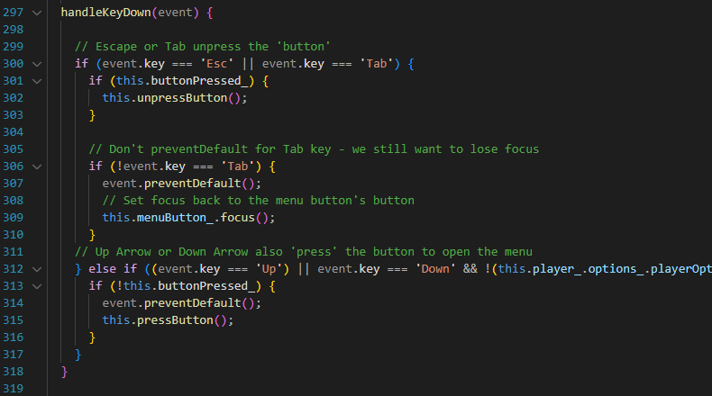
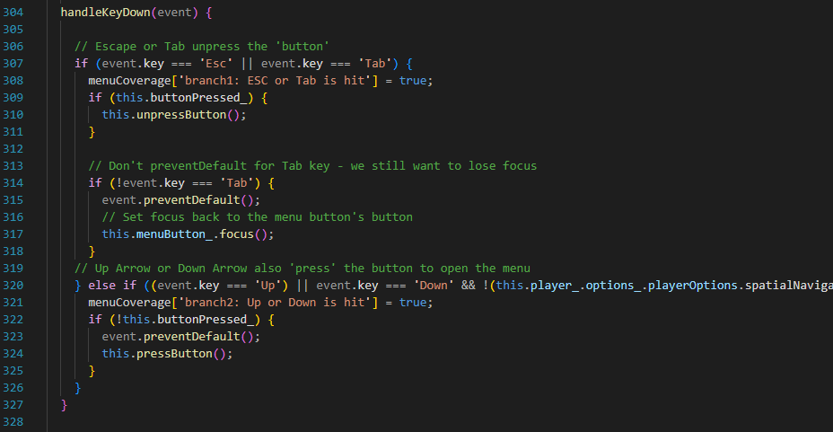
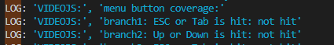
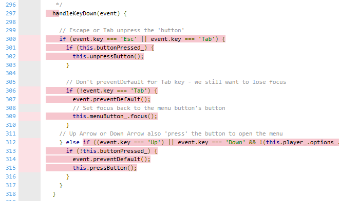
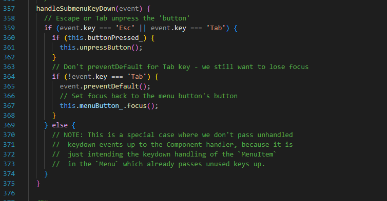
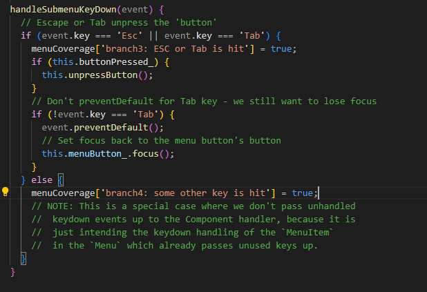
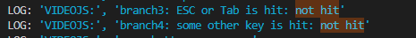
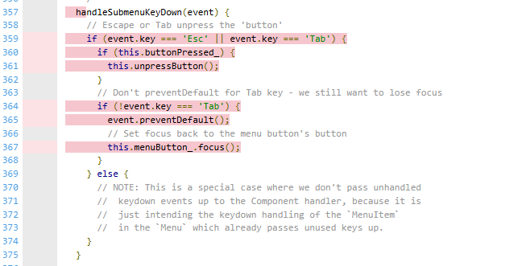
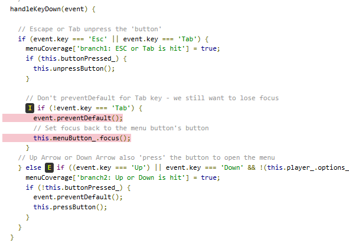
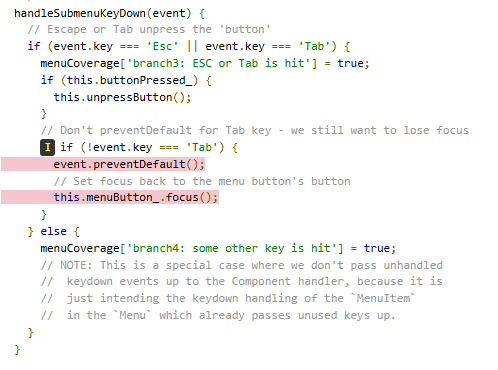

# Report for Assignment 1

## Project chosen

Name: video.js

URL: https://github.com/videojs/video.js

Number of lines of code and the tool used to count it: 68299

Programming language: JavaScript

## Coverage measurement

### Existing tool
The existing coverage tool that we use for this project is Istanbul. The coverage of this tool has already been implemented in the project and what we have to do is to enable the coverage tool on.

After digging around and getting some basic knowledge and intuition about the project, we figured out the way to enable the test procedure to return the coverage report under the HTML format:

In both rollup.config.js and karma.conf.js files:

This is the initial value of const CI_TEST_TYPE:
.jpeg)

In order to enable the report coverage to be returned, we change the value of this constant into the string: ‘coverage’
.jpeg)
.jpeg)

After reassigning new value to the const CI_TEST_TYPE, we can simply run the command: 
.jpeg)

This command starts cleaning all already built folders, then it lints all the source/test files to ensure conventions are maintained. Accordingly, the build of the system runs and all test units are executed.  

This is the coverage report that we received after running all unit tests.
.jpeg)

### Your own coverage tool

#### Tuan An Hoang
##### Function 1: handleKeyDown() in src/js/button.js

The code before being instrumented:

_button.png)

The code after being instrumented:
_button_instrumented.jpg)

This is the report we obtained after running our own coverage tool:

This is the evidence showing that the function is not fully covered in the original coverage report:

##### Function 2: handleKeyDown() in src/js/clickable-component.js
The code before being instrumented:

_clickable-component_no_instrument.jpg.png)

The code after being instrumented:
_clickable-component_instrumented.jpg)

This is the report we obtained after running our own coverage tool:

This is the evidence showing that the function is not fully covered in the original coverage report:

#### Hieu Nguyen Viet

##### Function 1: handleKeydown() in menu-button.js

The code before the instrumentation:

The code after the instrumentation:

Coverage results:

##### Function 2: handleSubmenuKeyDown() in menu-button.js

The code before the instrumentation:

The code after the instrumentation:

Coverage results:

#### Nguyen Duc Thinh

##### Function 1: textContent() function in src/js/utils/dom.js

The original code:

.jpeg)

The instrument code:

.jpeg)

My coverage tool and existing tool print before having test case:

.jpeg)

.jpeg)

##### Function 2: handleKeyDown() function in src/js/close-button.js

The original function:

The instrument function:

My coverage print before having test case:

The existing coverage tool for handleKeyDown() function:

#### Hoang Minh Phan
##### Function 1: handleKeyDown() in src/js/menu/menu.js

The existing coverage tool's report on this function:

The code difference of the implementation of new the coverage tool:

The log report of the new coverage tool:

##### Function 2: getMiddleware() in src/js/tech/middleware.js

The existing coverage tool's report on this function:

The code difference of the implementation of new the coverage tool:

The log report of the new coverage tool:

### Coverage Improvement

#### Tuan An Hoang

##### Test 1:
This is the new implemented test case:

This is the old coverage result:

This is the new coverage result:

You can see that the first branch now was hit by the test. The branch coverage of this function has increased from 50% (½) to 100% after the creation of this test case. The coverage is improved because the new test case manipulates the input to trigger an event via the “Enter” button, therefore, the first branch statement is passed. 

##### Test 2:
This is the new implemented test case:

This is the old coverage result:

This is the new coverage result:

You can see that the first branch now was hit by the test. The case is relatively the same with the test case above when in this new test case, we manipulate the data so that it can simulate a trigger event via the "Enter" button.

#### Hieu Nguyen Viet

##### Test 1:
This is the link to the new enhanced test cases: [test/unit/menu.test.js](https://github.com/cukibe123/SEP-Group-46/commit/e9ab648893a67a62dcc9073888fb5aa9e687051d)

Old Coverage Results:

New Coverage Results:

The previous version of the test file did not cover the situation where the ESC or Tab was pressed. What we did was simply add tests in. The function coverage was 0% and we got it up to 85%.

##### Test 2:

This is the link to the new enhanced test cases: [test/unit/menu.test.js](https://github.com/cukibe123/SEP-Group-46/commit/e9ab648893a67a62dcc9073888fb5aa9e687051d)

Old Coverage Results:

New Coverage Results:

This coverage was basically the same and two tests was included to cover the cases where ESC or Tab is pressed. The coverage went from 0% to 90%.
****
#### Duc Thinh Nguyen

##### Test 1:
This is the image of the new implemented test:

.png)

Old Coverage Results:

.jpeg)

New Coverage Results:

##### Test 2:

This is the image of the new implemented test:

Old Coverage Results:

New Coverage Results:

## Statement of individual contributions

#### Tuan An Hoang
I implemented the instrumentation for two handleKeyDown() functions of src/button.js and src/clickable-component.js and also created new test cases for these two function to improve branch coverage from 50% to 100%.

#### Hieu Nguyen Viet 
I looked through the functions and found 2 similar ones to deal with. It was obvious what the problem was when the cases of pressing ESC and TAB was not covered. I took the previous tests that the owners made as examples and went along with it. I wrote down all the branches that was included in the code and created tests for each of those branch.

#### Duc Thinh Nguyen
Find 2 function untested, ones is textCont() function in src/js/utils/dom.js and ones is handleKeYDown() function in src/js/close_button.js, made coverage tracks for them and create test cases to improve branch coverage.
